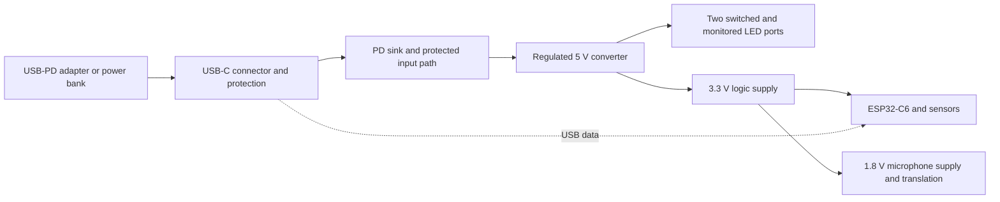

# Splanc product family design

Revision 0.1 — 9 September 2026

## Decision and scope

Splanc has three product SKUs: **Splanc Mini**, **Splanc Battery**, and
**Splanc Max**. Mini is the Kickstarter demo product and the immediate engineering
priority. Battery and Max are roadmap architectures; their detailed engineering,
cost commitments, and delivery dates are deferred.

This document supersedes the assumption that the first product must include
onboard battery management. It specifies product direction, not a manufacturing
release. The existing `hardware/splanc_dev` implementation is still the
battery-capable engineering baseline. The USB-only Mini conversion has not yet
been implemented. Preserve that baseline for later Battery work.

## Product definitions

### Splanc Mini

A standalone, wireless, sensor-equipped controller for two 5 V addressable LED
outputs. USB Power Delivery is its only power input. A suitable external USB-PD
power bank provides portable operation; an external adapter provides fixed power.

Mini retains the ESP32-C6, microphone, compass, motion and pressure sensing,
independent LED output control and monitoring, native USB data, user buttons,
and enclosure-friendly interfaces. Removing battery electronics must not remove
those features.

Mini has no cell connector, charger, pack fuel gauge, pack thermistor inputs,
battery configuration straps, or battery/USB source selector. It does not report
the state of charge of an arbitrary external power bank. Removing its USB power
source stops operation; seamless power-bank replacement is outside Mini's scope.

### Splanc Battery

The Mini feature set plus managed battery operation and USB charging. The
intended battery options remain factory-configured high-discharge 18650 packs:
1S1P, 1S2P, 1S3P, 2S1P, 2S2P, and 2S3P. Users do not change the series count
with a switch or software setting.

Battery adds charge control, calibrated state-of-charge reporting, temperature
sensing, pack protection integration, and coordinated source selection. It must
operate from USB with no pack fitted. Charge power must fit within the actual
USB contract after reserving system power. Pack protection and 2S balancing
remain required, whether integrated into the pack or subsequently designed onto
the product.

The existing battery design is a starting point, not a locked component choice.
In particular, LTC4421 availability, source-transfer hold-up, inrush, fault limits,
and pass-FET thermal/SOA behavior remain unresolved engineering work. Do not
carry those constraints into Mini or delay Mini to solve them. Cell selection,
pack construction, charge rates, calibration, enclosure size, and runtime claims
will be settled during Battery development.

### Splanc Max

A Raspberry Pi-based, **20-channel** LED controller implemented as **two boards**:

1. **Max HAT:** Raspberry Pi interface, Gowin FPGA, buffering, timing generation,
   configuration/programming interfaces, and the control side of isolation.
2. **Max power distribution board:** strip connectors, power inputs, isolation's
   field side, output drivers, channel switching/protection, and power telemetry.
   It supports strips powered at **5 V, 12 V, and 24 V**.

These are two boards within one product architecture, not twenty high-current
outputs routed through a Pi header. A channel means an independently controlled
LED data output with an associated protected strip-power connection. Supported
strip protocols, pixels per channel, refresh rate, and cable lengths are future
requirements; channel count alone does not establish those capabilities.

Max does not yet inherit a promised onboard sensor suite from Mini. Whether it
includes local sensors, accepts a remote Mini as a sensor source, or does both
is a later product decision. The Raspberry Pi and external power supplies are
not assumed to be included in the retail package.

## Mini electrical architecture

### Power behavior

- Retain the requested **up-to-20 V / 5 A PD input capability**. Firmware must
  use the accepted contract and cable allowance, not assume the requested power
  was granted. The present TPS25730D is the starting PD controller; it integrates
  a protected sink path. [TI TPS25730 documentation](https://www.ti.com/lit/ds/symlink/tps25730.pdf)
- The inherited LED application budget is **5 V, 4 A aggregate across both
  ports (20 W)**. This is the working demo baseline, not a newly validated rail
  rating. Finalize the measured LED peak load, controller overhead, converter
  losses, and margin before specifying the minimum supported adapter or bank.
  A 100 W input capability does not imply a 100 W LED output rating.
- Start in a low-load state with LED switches disabled. Enable outputs only
  after validating the available power and 5 V rail. Enforce both per-port
  limits and an aggregate budget. Loss of contract, undervoltage, or hardware
  fault must reduce or disable LED load rather than rely on a source reset.
- Define and test the lower-power-source behavior: control-only operation,
  limited brightness, or an explicit unsupported-source indication. Startup
  at initial 5 V and transitions to higher PD voltages must work without
  requiring the main MCU to be powered before negotiation can begin.
- Keep USB CC/data protection, suitable VBUS transient protection, input inrush
  control, converter protection, and independent LED-channel fault protection.
  Removing the source selector does not remove these responsibilities.
- Retain the current buck-boost converter for the first cost comparison. Evaluate
  a simpler buck as a separate optimization, including behavior at a 5 V source
  and during negotiation. Do not assume a buck can maintain regulated 5 V from
  a cable-fed 5 V input at full load.

### Functional baseline

The current cost-reduced component choices are engineering candidates:

- ESP32-C6-WROOM-1-N8: wireless control and local application processing.
- Two 5 V addressable LED ports: level-shifted data, default-off power switches,
  individual current/voltage monitoring, and hardware fault reporting.
- ICM-42670-P: motion sensing, I2C address 0x68.
- MMC5603NJ: compass, I2C address 0x30.
- BMP580: pressure sensing, I2C address 0x46. Confirm manufacturer documentation
  access and continuing supply before freezing this choice.
- T5848 / MMICT5848-00-012: I2S microphone with a dedicated 1.8 V supply and
  translation on clock, word-select, and data.
- Native USB programming/debugging, reset and boot buttons, two user buttons,
  and two status indicators. Repurpose the former charging indicator as a
  firmware-controlled status/fault indicator while preserving the light-pipe row.

The source uses `board.mpu` as a stable placement address for the new IMU; it
does not mean MPU-6050 is still fitted. Older battery design notes contain
superseded sensor names. Port and validate the actual sensor drivers rather
than reusing the old register maps. Share application behavior across Mini and
Battery through explicit board capabilities; battery drivers and source-transfer
GPIO assumptions must not be active on Mini.

### Mechanical and layout requirements

Start from the 85 × 65 mm, four-layer placement study. A smaller Mini is desirable
if deletion of battery circuitry permits it, but no reduced dimensions are yet
committed. A size change requires revisiting all enclosure geometry.

Keep four M2.5 corner mounts with 2.7 mm nonplated holes and the existing 7 mm
diameter mounting clearances as the initial mechanical baseline. Maintain
component and copper clearance on both faces for fasteners and enclosure posts.

Place the two LED JST connectors along one edge with their pin rows parallel to
that edge. Use two instances of the same port sub-layout: connector, switch,
monitor, shunt, data shifter, termination, and local capacitors. Preserve the
existing 11 mm port pitch initially; route equivalent cells consistently.

Retain side-actuated buttons for compliant enclosure levers and align status
LEDs for light pipes. Remove the XT30 and battery thermistor openings from Mini's
enclosure. Preserve the microphone's acoustic hole and enclosure sound path,
the radio antenna keepout, and compass separation from switching magnetics and
high-current loops. Review assembly capability for the compass's small WLP.

## Mini economics and sourcing

The 9 September cost exercise at a 1,000-board quantity estimated **$49.68** in
components for the revised battery-capable board. Deleting battery-specific
circuitry gives a **$24.05 preliminary Mini component estimate**, approximately
**$25.64 less per board**. The estimate removes 104 component instances and
retains the existing converter, both status LEDs, and the complete sensor suite.

This is a subtraction estimate from the existing BOM, not a priced and verified
USB-only netlist. Recalculate price breaks and order multiples after the Mini
BOM is generated; shared-part quantities will fall. The exact status-indicator
implementation and any converter redesign can change the total.

Deleting the LTC4421 removes the known stock bottleneck. Other retained parts
had sufficient listed stock in the sourcing snapshot for a 1,000-board run with
3% spares, but cached listings are not allocated inventory. Recheck the actual
Mini order quantities with authorized suppliers before procurement.

The estimate excludes PCB fabrication, assembly, test, yield losses, enclosure,
fasteners, light pipes, strip accessories, power bank/adapter, cable, freight,
and taxes. Do not set the Kickstarter selling price from component cost alone.
Battery and Max have no approved cost targets or retail prices yet.

## Max architecture reserved for later engineering

The working interpretation of **isolated HVHC** is galvanic isolation between
the Raspberry Pi/HAT control domain and the strip-power domain. Here HVHC means
the higher-voltage/high-current distribution subsystem; no mains input is
specified. Channel-to-channel isolation and isolation among the 5/12/24 V rails
are **not yet specified** and must not be implied by the product description.

The isolation boundary must cover data, enable/fault/telemetry links, and any
power crossing that boundary. A shared ground, debug cable, mounting connection,
or auxiliary interface must not unintentionally bypass it. Isolation voltage,
working voltage, spacing, surge environment, and test criteria are future design
inputs; this document does not assert a certified isolation rating.

The proposed division of responsibility is:

- The Pi runs the application and prepares frames. The FPGA buffers updates and
  generates deterministic waveforms for all 20 outputs. Define frame ordering,
  simultaneous update behavior, underrun handling, and host-loss behavior.
- The HAT carries logic, not strip current. Select the Pi models and applicable
  HAT/HAT+ mechanical, identification, and power requirements before assigning
  pins. HAT power budgeting and Pi back-power behavior require an explicit
  design. [Raspberry Pi HAT+ specification](https://datasheets.raspberrypi.com/hat/hat-plus-specification.pdf)
- Select the Gowin family/package after budgeting I/O, timing engines, memory,
  host bandwidth, clocks, configuration storage, programming, toolchain support,
  price, and stock. No FPGA part number is frozen.
  [Gowin product documentation](https://www.gowinsemi.com/en/document/main/database/1827/)
- The distribution board provides 20 repeated protected output cells, suitable
  data drivers referenced to the strip domain, and local fault handling. Outputs
  default off during boot, missing control, and invalid configuration. A hardware
  shutdown path must not depend solely on Linux or a healthy FPGA bitstream.
- A planning baseline is externally regulated 5/12/24 V supplies feeding clearly
  assigned voltage banks. Whether mixed voltages operate simultaneously, whether
  selection is per port or per bank, and whether onboard conversion is needed
  are open decisions. Never assume a 12/24 V strip expects 12/24 V data signaling.
- Specify per-channel current, aggregate rail current, fusing, conductor and
  connector ratings, power injection, cooling, reverse connection behavior, and
  short-circuit response before choosing a topology. Twenty channels must not
  be translated into an arbitrary aggregate wattage.

Reserve a versioned frame/control protocol and capability discovery across the
family. Mini firmware should not depend on future FPGA transport or wait for Max
protocol implementation to become demo-ready.

## Kickstarter demo execution plan

### 1. Implement the Mini circuit

Create a distinct Mini hardware/firmware target while preserving the Battery
baseline. Remove charger, gauge, source selector, battery connector, thermistor
interfaces, and factory battery straps. Feed the 5 V converter from the protected
PD output. Reassign the second status LED and update the fixture pin map,
firmware capabilities, constraints, circuit audits, and generated BOM together.

### 2. Complete PCB engineering

Validate converter operation and power budgets, finish the repeated LED cells,
route the board, and run independent KiCad connectivity/DRC checks. Review
decoupling, current loops, Kelvin connections, copper temperature rise, magnetic
coupling, acoustic geometry, and enclosure fit. Audit source footprints and
models against the selected physical parts. Atopile build success and a
zero-overlap placement are not manufacturing acceptance criteria.

### 3. Assemble and bring up demo units

Test USB-only startup, negotiation changes, cable/source removal, peak LED load,
port faults, radio operation, every sensor, buttons, and indicators. Qualify a
small named set of adapters and power banks, including low-load idle behavior
and resets during source renegotiation. Record the tested power budget and
thermal conditions. Port the EoL fixture to Mini and verify USB programming and
channel fault measurements.

### 4. Capture product demos

Demonstrate two independent LED outputs, microphone-reactive effects,
motion/compass behavior, wireless control, and operation from an external PD
power bank on actual hardware. Verify pressure sensing during bring-up; include
it in launch claims only to the extent supported by the application demo.

Use the enclosure's buttons, light pipes, and acoustic path during demonstrations.
Produce clean product renders from the final routed Mini CAD and identify them
as renders. The current battery-capable placement preview is not a Mini product
shot. Do not depict unbuilt Battery or Max designs as working launch hardware.

### 5. Freeze the demo and production candidates separately

Archive the exact demo PCB, firmware, BOM, source/cable list, and measured
results. Release a production candidate only after the broader manufacturing
and acceptance checks are complete. The campaign may show Mini as the active
product and Battery/Max as future concepts; no Battery/Max delivery date or
funded engineering commitment is established by this document.

## Decisions still needed

Before Mini schematic freeze: confirm peak LED demand and the minimum supported
PD contract, retain versus replace the converter, approve the pressure sensor's
supply/documentation path, and choose whether power accessories are bundled.
Before enclosure freeze: confirm outline, connector access, lever travel, light
pipes, and acoustic coupling on the physical assembly.

During later Battery work: select and qualify cells/packs, settle charge and
discharge limits, choose the power path, and define transfer/runtime requirements.
During later Max work: settle the isolation boundary and rating, per-port and
aggregate power, mixed-voltage behavior, supported strips and throughput,
Pi/HAT compatibility, inter-board link, and FPGA selection.

None of the Battery or Max decisions blocks Mini development.
