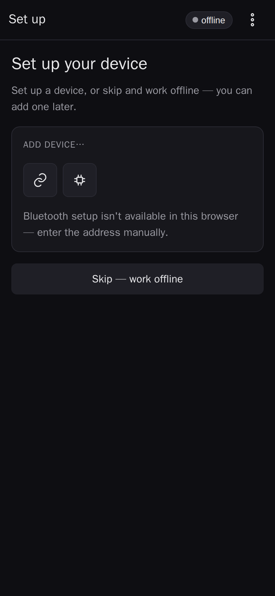
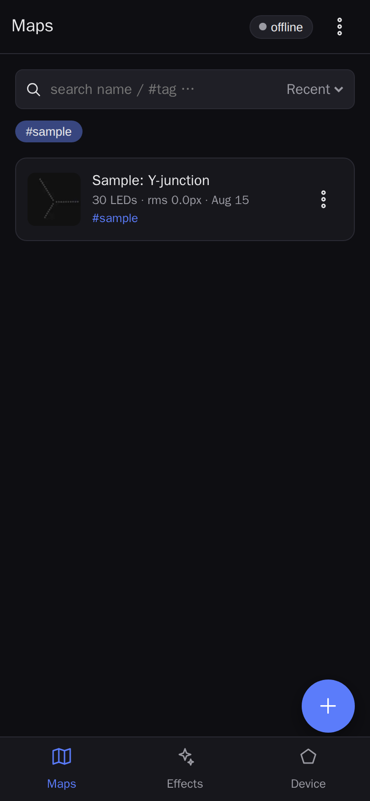
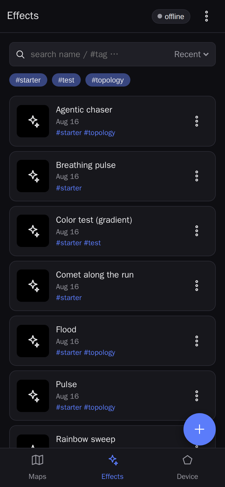
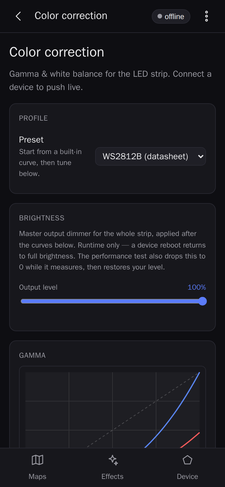
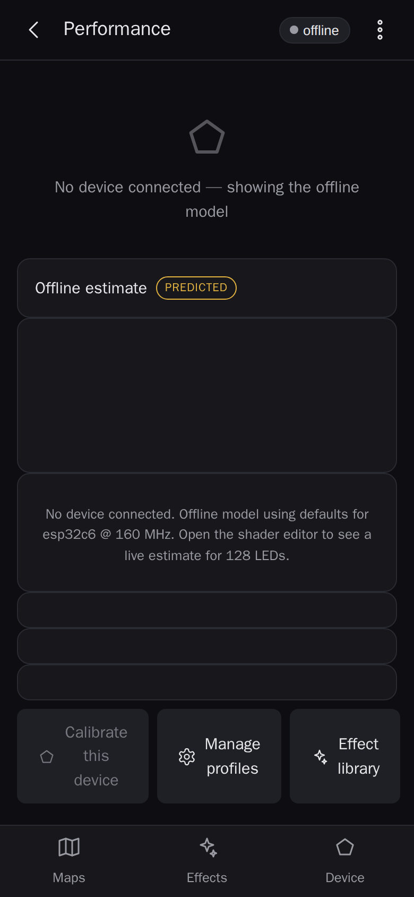
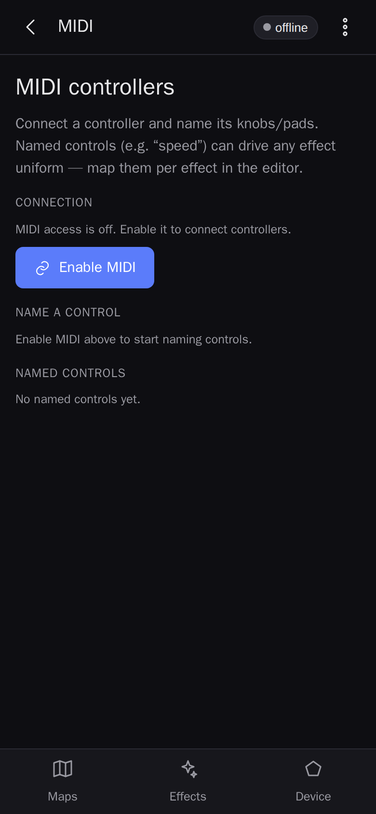
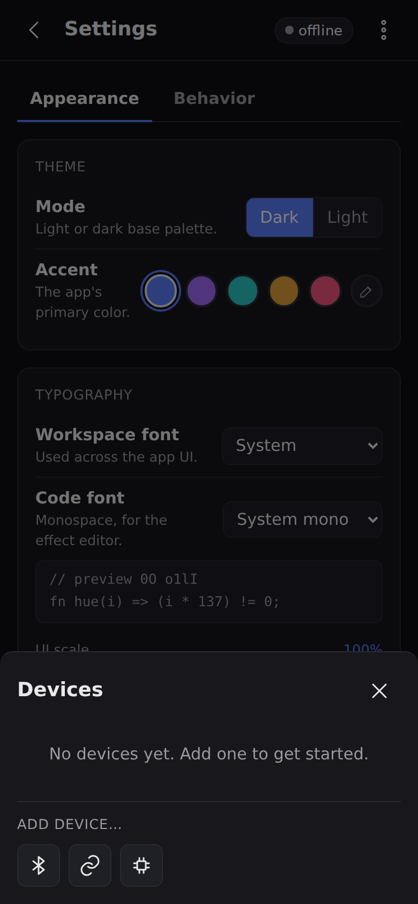
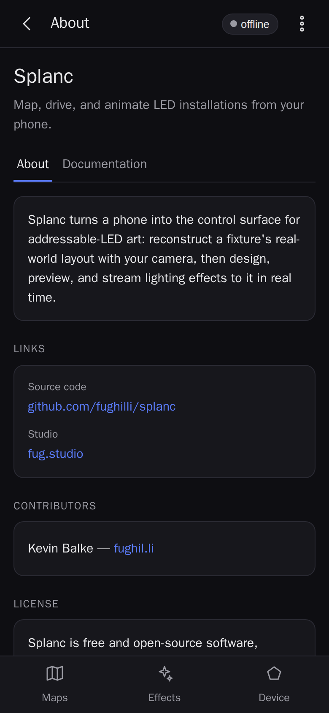

<!-- Generated by web/tests/tools/genUserGuide.ts. DO NOT EDIT BY HAND. -->

# Splanc user guide

This guide walks through every user-facing feature of Splanc — the phone app for mapping,
controlling, and animating addressable LED fixtures. It is **auto-generated** from the same catalog
that drives the app's in-app interactive tutorial (`web/src/ui/guide/catalog.ts`), so the two never
drift. Regenerate it with:

```sh
bazel run //web:gen_user_guide
```

You can take the same tour interactively inside the app: on first launch a hint offers it, and you
can restart it any time from **Settings ▸ Help & tutorial**. This document is also published as a
static site at `/user-guide/` on the deployed app.

## Contents

- **Getting started**
  - [Welcome to Splanc](#welcome-to-splanc) — Map, control, and animate addressable LED fixtures
    from your phone.
- **Maps**
  - [The maps library](#the-maps-library) — Browse, search, organize, import, and export your
    captured fixtures.
  - [Mapping a fixture with the camera](#mapping-a-fixture-with-the-camera) — Point the camera at a
    running fixture to reconstruct its LEDs in 3D.
  - [The mapping workspace](#the-mapping-workspace) — Inspect the 3D solve, clean up topology, and
    push maps to a device.
- **Effects**
  - [The effects library](#the-effects-library) — Browse, create, tag, and test the shader effects
    that drive your LEDs.
  - [The effect editor](#the-effect-editor) — Write, preview, and push shader effects with the exact
    on-device VM.
- **Devices**
  - [Connecting a device](#connecting-a-device) — Link a controller over Bluetooth or by address —
    or start offline.
  - [Managing devices](#managing-devices) — Connect, rename, re-discover, and forget the controllers
    you know.
  - [Flashing firmware](#flashing-firmware) — Commission a blank board over USB, right from the
    browser.
  - [Color correction](#color-correction) — Tune per-device gamma and white balance so colors read
    true.
  - [Performance & calibration](#performance--calibration) — Watch the live frame budget and
    calibrate a device's cost model.
- **Settings & help**
  - [MIDI controllers](#midi-controllers) — Name physical knobs and bind them to effect parameters.
  - [Appearance & behavior](#appearance--behavior) — Theme the app, pick fonts, and tune the 3D view
    and capture defaults.
  - [Help, tutorial & about](#help-tutorial--about) — Restart this tutorial any time, and find
    licensing and credits.

## Getting started

### Welcome to Splanc

_Map, control, and animate addressable LED fixtures from your phone._



Splanc turns a phone into the control surface for addressable LED art. You point the camera at a
running fixture, the app watches the LEDs blink out their addresses, and it reconstructs where every
LED sits in 3D space. That map then drives real-time effects on the fixture — authored on the phone
and played back by the on-device firmware.

Everything lives on the device in front of you: maps and effects are stored locally in the browser,
and the app works fully offline once loaded. It is an installable PWA, so you can add it to your
home screen and launch it like a native app.

#### The three tabs

The bottom bar is the whole app in miniature:

- **Maps** — your library of captured fixtures and the 3D mapping workspace.
- **Effects** — the effect library and the in-app shader editor.
- **Device** — connect to, name, flash, and tune the physical controllers.

## Maps

### The maps library

_Browse, search, organize, import, and export your captured fixtures._



The Maps tab is your library of captured fixtures. Each row is one map — a solved 3D reconstruction
of a fixture's LEDs. Search by name, filter by tag, and group maps into folders for larger
installations.

#### Managing the library

- Tap a map to open its **mapping workspace** (the 3D solve + topology tools).
- The **+ New** button starts a fresh camera capture.
- A row's ⋯ menu renames, tags, moves to a folder, duplicates, or deletes.
- The tab's ⋯ menu **imports and exports** the whole library as a bundle, so you can move maps
  between phones or back them up.

### Mapping a fixture with the camera

_Point the camera at a running fixture to reconstruct its LEDs in 3D._

Capture is where a physical fixture becomes a map. The connected device runs a special addressing
pattern — each LED blinks out its own index in a gray-coded sequence — and the phone camera decodes
those blinks frame by frame, building up a per-LED position estimate as you move the phone around
the fixture.

#### How a capture goes

- Grant camera access and frame the fixture so its LEDs fill a good part of view.
- Move slowly around the fixture — parallax from multiple angles is what lets the solver triangulate
  depth.
- The live overlay shows detected LEDs and decode progress; keep going until coverage looks
  complete.
- **Advanced ▸ Manual override** exposes a manual exposure slider for tricky lighting (its ceiling
  is set in Settings ▸ Behavior).
- Stop when done — the app runs a final solve and drops you into the new map's workspace.

The heavy solve can run on-device (WASM) or on a host server; the app picks the better placement
automatically.

### The mapping workspace

_Inspect the 3D solve, clean up topology, and push maps to a device._

Opening a map lands you in its workspace — an orbitable 3D view of the solved LEDs plus the tools to
refine and use the map.

#### What you can do here

- **Inspect the solve** in 3D: orbit, zoom, and auto-scale/recenter the view.
- **Edit topology** — the skeleton graph that says which LEDs are neighbors. A single Cleanup knob
  handles most fixtures; a Fine-tune disclosure exposes the full extraction options.
- **Send to / pull from a device** so the fixture and the app agree on the map.
- **Jump to Effects** to start animating this fixture.
- **Edit metadata** — name, tags, and folder.

The 3D view honors the render knobs in Settings ▸ Appearance (LED size, glow, background, ground
grid, and axes triad).

## Effects

### The effects library

_Browse, create, tag, and test the shader effects that drive your LEDs._



The Effects tab is a library of animations, mirroring the maps browser: a search box, tag chips,
folders, and a row per saved effect. Tap one to open the editor; the + button creates a new effect
from a starter template.

#### In the library

- **Search and tag** effects, and group them into folders.
- **Animated previews** can be enabled in Settings ▸ Appearance ▸ Experimental (off by default —
  they're heavy on mobile).
- **AI key** — a discoverable affordance to bring your own API key for the editor's AI assistant
  (optional; see the effect editor).
- The tab's ⋯ menu can **send the whole library to a debug server**.

### The effect editor

_Write, preview, and push shader effects with the exact on-device VM._

The editor is a full-screen workspace for one effect. You write the effect's source, and the app
compiles it off-thread and previews it live over a map using the EXACT same virtual machine the
firmware runs — so what you see is what the fixture will do. Edits autosave back to the library.

#### Editor features

- **Live preview** on a real map with the firmware VM, plus a preview grid.
- **Uniforms pane** — expose tunable parameters (speed, color, …) and bind them to MIDI controls or
  the on-screen sliders.
- **Compile feedback** — errors surface inline as you type.
- **Push to device** — when a controller is connected, send the compiled `.fxb` and live uniform
  values so the fixture updates as you edit.
- **AI assistant** (optional, bring-your-own-key) — describe a change in words and have it drafted
  for you.

## Devices

### Connecting a device

_Link a controller over Bluetooth or by address — or start offline._

A Splanc device is an ESP32 controller running the player firmware. The app talks to it over a
secure WebSocket on your local network; to get there it first has to learn the device's Wi-Fi and
address.

#### Ways to add a device

- **Bluetooth** — the app scans over Web Bluetooth and provisions the board onto a Wi-Fi network you
  pick (Improv). Shown where the browser supports it.
- **Manual address** — type a device's LAN address directly if you already know it.
- **Flash a blank board** — commission a brand-new board over USB (see Flashing firmware), then
  provision it.
- **Skip / go offline** — explore maps and effects with no hardware; connect later from the Device
  tab.

Once linked, the connection status shows in the app-bar pill at the top of every screen. Tap it (or
the Device tab) any time to reopen the device sheet.

### Managing devices

_Connect, rename, re-discover, and forget the controllers you know._

The device sheet — reachable from the app-bar pill and the Device tab on every screen — lists the
controllers you've added, each with a live reachability indicator probed over the same WebSocket the
app uses.

#### Per-device actions

- **Connect** to a reachable device to make it the active target for maps and effects.
- **Re-discover over Bluetooth** when a device has moved networks or gone unreachable.
- **Rename** — the display name is reflected to the device itself.
- A row's ⋮ menu shows the recorded LAN address, MAC, and Bluetooth name, and can **forget** the
  device.

### Flashing firmware

_Commission a blank board over USB, right from the browser._

Splanc can flash the player firmware onto a USB-connected board directly from the browser — no
toolchain, no command line. The flash sheet (from the Device tab) writes the firmware image this
build bundles over Web Serial, with live progress, a log, and a diagnostics panel.

#### Good to know

- Works on desktop Chromium (native Web Serial) and Android Chrome (via a WebUSB polyfill).
- iOS Safari has neither API, so flashing isn't available there — the sheet says so rather than
  failing silently.
- After flashing, provision the fresh board onto Wi-Fi like any other device.

### Color correction

_Tune per-device gamma and white balance so colors read true._



Different LED strips render color differently. Color correction is a per-device surface for the
strip's gamma and white-balance curves: pick a built-in profile, tune per-channel gamma and white
balance by value or by dragging the transfer curve, and preview the effect on real colors before
(and while) it's on the strip.

The curve math mirrors the firmware exactly, so the on-screen simulator matches what the fixture
actually shows.

### Performance & calibration

_Watch the live frame budget and calibrate a device's cost model._



Effects have to fit inside the device's per-frame time budget. The Performance panel (from the ⋯
menu) shows the running effect's frame budget live when a device is connected: a
frame-time-vs-budget graph, a per-phase breakdown (update / shade / show), and a headroom gauge.

#### Calibration

- **Calibrate this device** runs ~30 s of tiny benchmark effects on the connected controller and
  least-squares-fits its per-opcode cost model, so the app's predictions match your exact hardware.
- Offline, the panel shows the predicted cost model from the default table.
- **Performance profiles** manages saved per-device cost tables.

## Settings & help

### MIDI controllers

_Name physical knobs and bind them to effect parameters._



Splanc can drive effect parameters from a hardware MIDI controller. Under Settings ▸ MIDI you enable
Web MIDI, see connected devices, and give physical controls semantic names: wiggle a knob, type
"speed", assign.

Those names are global, so any effect with a matching uniform can bind to them. The per-effect
binding itself lives in the effect editor's Uniforms pane.

### Appearance & behavior

_Theme the app, pick fonts, and tune the 3D view and capture defaults._



Settings is split into Appearance and Behavior. Every control writes through immediately and
persists across reloads, with a live 3D preview so the render knobs show their effect as you drag.

#### Appearance

- **Theme** — light/dark and an accent color (presets or a custom picker).
- **Typography** — a workspace font, a monospace font for the editor, and a UI scale.
- **3D view** — LED point size, glow, background, and default ground grid / axes.
- **Startup** — toggle the branded launch splash.
- **Experimental** — opt into animated effect previews in the library.

#### Behavior

- **Manual exposure ceiling** — the top of the capture screen's manual exposure slider, for lighting
  a frame under artificial light.

### Help, tutorial & about

_Restart this tutorial any time, and find licensing and credits._



The interactive tutorial you can launch in the app is dismissible — once you skip or finish it, it
won't nag you again. You can restart it any time from **Settings ▸ Help & tutorial**, which also
links back to this documentation.

The **About** page (⋯ menu) describes the project, states the license and copyright, links to the
source, and lists the open-source components the app ships.
